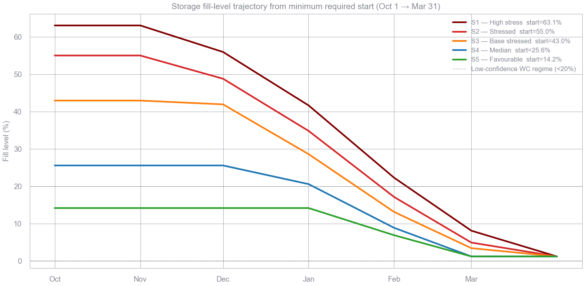

# Czech UGS Storage Sizing — Synthesis Brief

**Purpose of this document**  
This is a feed-in document for a larger modelling exercise. It summarises
the key findings and quantitative outputs from three analytical notebooks
([analysis.ipynb](../notebooks/analysis.ipynb),
[storage_monthly.ipynb](../notebooks/storage_monthly.ipynb),
[withdrawal_curve.ipynb](../notebooks/withdrawal_curve.ipynb)) and flags
the open questions that a final storage target model must resolve.

---

## 1. Data and scope decisions (common to all notebooks)

| Decision | Choice | Rationale |
|---|---|---|
| Data source | ENTSOG Physical Flows — all NET4GAS entry points | Physical flows record actual cross-border volumes; commercial allocations can differ |
| Structural break | Post-2022-03-01 only | Pre-2022 data includes Russian transit and 2021 storage-filling arbitrage — volumes structurally impossible under current market |
| Season definition | October–March | Aligns with Czech regulatory winter; Oct and Mar are shoulder months with higher uncertainty |
| Sample size | 1,550 post-cutoff days (760 winter days), covering four full winters (2022/23–2025/26) | Short but structurally homogeneous |

---

## 2. Supply-side: import reliability (`analysis.ipynb`)

### What was estimated
The empirical distribution of daily winter imports and 30-day rolling averages,
expressed as percentiles.  These percentiles define how much import capacity
can be **reliably counted on** at a given risk level.

### Corridor structure
Post-2022 Czech imports are overwhelmingly sourced from **Germany (DE THE BZ)**:
- Germany median: **~217 GWh/d** in winter
- Slovakia median: **0 GWh/d** (intermittent; active on ~306 of 760 winter days, max 176 GWh/d)
- **Single-corridor concentration is a key qualitative risk factor.**

### Season-on-season stability
| Gas winter | Peak (GWh/d) | P90 (GWh/d) | Median (GWh/d) |
|---|---|---|---|
| 2022/23 | 673 | 384 | 232 |
| 2023/24 | 361 | 307 | 251 |
| 2024/25 | 508 | 366 | 215 |
| 2025/26 | 389 | 355 | 244 |

No clear trend; volumes are broadly stable. The 2022/23 season had unusually
high peaks (storage filling / LNG surge). A recovering European demand
environment would raise imports and reduce storage needs — not captured in
current estimates.

### Import percentile table (post-2022, winter, all months pooled)

| Percentile | Single-day (GWh/d) | 30-day rolling avg (GWh/d) |
|---|---|---|
| P10 | 139 | 156 |
| P20 | 160 | 189 |
| P30 | 197 | 202 |
| P50 | 251 | 240 |
| P70 | 312 | 282 |
| P80 | 350 | 313 |
| P90 | 381 | 347 |

**Key observation**: the 1-in-20 peak demand of 370 GWh/d sits near the P90
of observed single-day imports, meaning on ~90% of recent winter days imports
were below the peak demand level.  Storage must bridge the gap on almost every
stressed day.

### Flat-winter storage scenarios (30-day horizon, peak demand = 370 GWh/d)

| Scenario | Import basis | 30d avg import (GWh/d) | Daily gap (GWh/d) | Storage required (TWh) |
|---|---|---|---|---|
| S1 — High stress | P10 | 156 | 214 | **6.41** |
| S2 — Stressed | P20 | 189 | 181 | **5.43** |
| S3 — Base stressed | P30 | 202 | 168 | **5.03** |
| S4 — Median | P50 | 240 | 130 | **3.90** |
| S5 — Favourable | P70 | 282 | 88 | **2.65** |

Interpretation of S2: pairing a 1-in-20 demand event with a 1-in-5 import
shortfall gives a joint severity of roughly 1-in-100 — a common planning
anchor for critical infrastructure.

**Czech UGS working-gas capacity reference**: 45.3 TWh (AGSI+).  All scenarios
fit within total installed capacity; the policy question is how much must be
**mandatorily held** at start of winter.

---

## 3. Month-by-month storage sizing (`storage_monthly.ipynb`)

### What was estimated
The flat-winter approach in Section 2 uses a single pooled import percentile
and a single peak demand figure.  This notebook disaggregates to individual
calendar months using:
- **Month-specific peak demand** from the 1-in-20 demand model (external file `r_max_den_2025-2026.csv`)
- **Month-specific import percentiles** computed separately for each calendar month

### Monthly peak demand (1-in-20)

| Month | Peak demand (GWh/d) |
|---|---|
| Oct | 163 |
| Nov | 244 |
| Dec | 325 |
| Jan | **368** |
| Feb | 327 |
| Mar | 245 |

### Monthly results — S2 (P20 imports) and S5 (P70 imports)

| Month | P20 import (GWh/d) | Gap S2 (GWh/d) | Storage S2 (TWh) | P70 import (GWh/d) | Gap S5 (GWh/d) | Storage S5 (TWh) |
|---|---|---|---|---|---|---|
| Oct | 213 | 0 | 0.00 | 357 | 0 | 0.00 |
| Nov | 160 | 85 | 2.54 | 342 | 0 | 0.00 |
| Dec | 142 | 184 | 5.70 | 341 | 0 | 0.00 |
| Jan | 135 | 233 | 7.22 | 272 | 96 | 2.97 |
| Feb | 149 | 178 | 4.98 | 244 | 83 | 2.32 |
| Mar | 196 | 49 | 1.51 | 350 | 0 | 0.00 |
| **Total** | | | **21.94** | | | **5.29** |

### Methodological note
The monthly approach uses **single-day** import percentiles; the flat-winter
approach uses the **30-day rolling average** percentile.  These are not directly
comparable:
- Rolling-average smooths intra-month variance → typically higher percentile
  value → less conservative storage estimate.
- Month-by-month is more granular and allows demand to vary, but produces
  much higher totals because it treats each month's gap independently
  (implying the gap must be filled from storage each month rather than
  rolling a single level across the season).

**The 21.94 TWh S2 total is not directly comparable to the 5.43 TWh figure
from analysis.ipynb.** The two models answer different questions — see
Section 5 (open questions) for resolution.

---

## 4. Withdrawal capacity curve (`withdrawal_curve.ipynb`)

### What was estimated
The relationship between Czech UGS fill level (%) and maximum achievable
daily withdrawal rate (GWh/d).  This is the binding physical constraint on
how fast gas can actually be drawn once it is in storage.

### Method
- Data: GIE storage dataset 2011–2026, restricted to post-2022, Oct–Mar
- Two approaches fitted to the **P95 upper envelope** of observed withdrawals
  per 5 pp fill-level bin:
  - **Absolute**: P95 of raw withdrawal (GWh/d) — anchored to historical
    levels
  - **Relative**: P95 of utilisation ratio (withdrawal / declared capacity),
    scaled by current declared capacity (734 GWh/d) — normalises out
    the infrastructure growth from ~428 GWh/d (2011) to 734 GWh/d (2026)
- **Isotonic regression** enforced monotone increasing shape
  (higher fill → higher deliverability)

### Key findings from the withdrawal curve

| Fill level (%) | Absolute curve (GWh/d) | Relative curve (GWh/d) |
|---|---|---|
| 20 | ~180 | ~220 |
| 30 | ~220 | ~280 |
| 40 | ~280 | ~330 |
| 50 | ~310 | ~370 |
| 60 | ~370 | ~430 |
| 70 | ~400 | ~480 |
| 80 | ~430 | ~510 |
| 90 | ~460 | ~540 |

*(Exact values depend on the fitted curve — read from notebook output.)*

- Relative and absolute curves diverge at low fill levels, where the relative
  curve (preferred for forward-looking use) implies higher capacity than the
  absolute curve.
- At fill levels below ~20% the curve is poorly identified (few stressed days
  occur when storage is already almost empty) — **treat with caution**.
- P99 was rejected (too sensitive to outliers at low-n bins); P95 was chosen
  over P90 because P95 materially captures stressed high-demand days rather
  than noise.

### Implications for storage sizing
The withdrawal curve means that **fill level at start of winter matters not
just as volume but as rate**.  A storage target expressed only in TWh is
incomplete — the model must also verify that at the minimum fill level expected
during the cold spell, the withdrawal rate is sufficient to meet peak demand
minus imports.

---

## 5. Open questions for the final storage target model

The three notebooks establish the building blocks but leave the following
integration questions unresolved.

### 5.1 Which storage sizing method is the right framing?

Two conceptually different formulations have been developed:

| Formulation | Notebooks | Logic |
|---|---|---|
| **Flat 30-day horizon** | `analysis.ipynb` | Single 30-day cold period; import percentile from pooled season distribution; storage must cover one cold month |
| **Month-by-month cumulative** | `storage_monthly.ipynb` | Each month's gap is independent; seasonal total is sum of monthly gaps |

The month-by-month approach produces much larger totals because it implicitly
assumes storage must be **refilled** between months, or that the system cannot
carry forward surplus from low-demand months.  A proper simulation model
should track storage level as a **state variable** across the season.

### 5.2 How to integrate the withdrawal curve?

The withdrawal curve (`wc_curve_rel(fill_pct)`) must enter the model as a
**binding delivery constraint** in a draw-down simulation:

```
At each time step t:
  max_withdrawal_t  = wc_curve_rel(fill_pct_t)
  actual_delivery_t = min(max_withdrawal_t, daily_gap_t)
  fill_pct_{t+1}   = fill_pct_t − actual_delivery_t / total_capacity
```

If `actual_delivery_t < daily_gap_t`, the system is infeasible — storage
cannot meet demand even if it is nominally full enough in TWh terms.

### 5.3 What is the correct import assumption — pooled or month-specific?

- The flat approach uses a pooled winter percentile (ignores seasonal shape)
- The monthly approach uses month-specific percentiles but treats months independently
- A simulation approach should use month-specific percentiles applied to
  daily draws, carried across a continuous state-trajectory

### 5.4 What is the right risk metric for the joint event?

S2 (P20 imports) × 1-in-20 demand ≈ 1-in-100 joint event.  But:
- Are imports and demand negatively correlated (cold weather drives both
  high demand and low import pressure on German hubs)? If so, the joint
  probability is worse than the product of marginals.
- A correlation adjustment or copula model would sharpen the risk framing.

### 5.5 What is the withdrawal horizon — 30 days, or a full season?

The analysis.ipynb approach assumes a 30-day cold period.  In practice the
question is: how much storage is needed at **1 October** so that a 1-in-20
winter can be survived without shortfall?  This is inherently a full-season
(Oct–Mar, ~180 day) problem, with storage drawn down dynamically as monthly
demand and imports are realised.

---

## 6. Proposed final model design

Based on the above, the recommended integration approach is a
**season-long daily draw-down simulation**:

1. **Inputs (fixed per scenario)**
   - Month-specific peak demand profile (GWh/d) from 1-in-20 demand model
   - Month-specific import level (GWh/d) at chosen percentile (e.g. P20 for S2)
   - Withdrawal curve `wc_curve_rel(fill_pct)` from `withdrawal_curve.ipynb`
   - Starting fill level (% of 45.3 TWh) — the decision variable

2. **Simulation loop (daily, Oct 1 → Mar 31)**
   - Compute `daily_gap_t = max(0, peak_demand_t − import_t)`
   - Compute `max_withdrawal_t = wc_curve_rel(fill_pct_t)`
   - Check feasibility: `max_withdrawal_t ≥ daily_gap_t`
   - Update fill level: `fill_pct_{t+1} = fill_pct_t − daily_gap_t / capacity`

3. **Storage target**: minimum starting fill level such that the simulation
   never becomes infeasible (max_withdrawal < daily_gap) across the season.

4. **Scenario matrix**: run for S1–S5 import assumptions; report starting
   fill level (%) and corresponding TWh for each.

5. **Sensitivity**: vary peak demand ±50 GWh/d; vary season length;
   vary withdrawal curve (abs vs. rel).

This design resolves open questions 5.1–5.3 and produces a storage target
that is consistent with the physical delivery constraint.  Open question 5.4
(correlation) remains a qualitative caveat unless demand-import joint
distributions are modelled explicitly.

---

## 7. Key numbers cheat sheet (preparatory analyses)

> Numbers from the final integrated model are in **Section 8** and in
> [`docs/storage_target_results.md`](storage_target_results.md).

| Quantity | Value | Source |
|---|---|---|
| 1-in-20 peak demand (flat) | 370 GWh/d | `analysis.ipynb` assumption |
| Peak demand (monthly max, Jan) | 368 GWh/d | `storage_monthly.ipynb` |
| Post-2022 winter P20 import (pooled) | 189 GWh/d (30d avg) | `analysis.ipynb` |
| Post-2022 winter P70 import (pooled) | 282 GWh/d (30d avg) | `analysis.ipynb` |
| Storage S2 (flat 30-day) | 5.43 TWh | `analysis.ipynb` |
| Storage S5 (flat 30-day) | 2.65 TWh | `analysis.ipynb` |
| Storage S2 (monthly cumulative) | 21.94 TWh | `storage_monthly.ipynb` |
| Storage S5 (monthly cumulative) | 5.29 TWh | `storage_monthly.ipynb` |
| Czech UGS total capacity | 45.30 TWh | AGSI+ |
| Current declared withdrawal capacity | 734 GWh/d | `withdrawal_curve.ipynb` |
| Withdrawal cap at 50% fill (relative) | ~370 GWh/d | `withdrawal_curve.ipynb` |
| Withdrawal cap at 30% fill (relative) | ~280 GWh/d | `withdrawal_curve.ipynb` |
| Analytical cutoff | 2022-03-01 | all notebooks |
| Sample size (winter days) | 760 | `analysis.ipynb` |

---

## 8. Final model results (`storage_target.ipynb`)

The season-long draw-down simulation described in Section 6 has been implemented
in [`notebooks/storage_target.ipynb`](../notebooks/storage_target.ipynb).  Full
results, sensitivity tables and charts are documented in
[`docs/storage_target_results.md`](storage_target_results.md).

### Headline storage targets (minimum 1-October fill)

> **Numbers updated 2026-05-30 (Phase 1)** and **revised 2026-05-30 (T1/T4 fixes):**
> (1) Capacity updated from 45.3 TWh to 40.8 TWh (pre-inverse-storage AGSI+ figure).
> (2) End-of-season floor of 0.5 TWh at Mar 31 embedded as a hard simulation constraint.
> See [`docs/consulting_review.md`](consulting_review.md) T1/T4 responses,
> [`docs/wc_blend_decision.md`](wc_blend_decision.md), and
> [`docs/storage_target_results.md`](storage_target_results.md) for full detail.

| Scenario | Start fill (%) | Start fill (TWh) | Binding constraint |
|---|---|---|---|
| S1 — High stress    | 63.1 | **25.7** | End-of-season floor |
| S2 — Stressed       | 55.1 | **22.5** | End-of-season floor |
| S3 — Base stressed  | 43.0 | **17.5** | End-of-season floor |
| S4 — Median         | 25.6 | **10.4** | End-of-season floor |
| S5 — Favourable     | 14.2 |  **5.8** | End-of-season floor |

Czech UGS working-gas capacity: **40.8 TWh** (pre-inverse-storage AGSI+ figure).
All targets are within installed capacity.

### Key finding on binding constraint

With the 0.5 TWh end-of-season floor embedded and the 75/25 blended WC curve,
the binding constraint for **all scenarios** is the end-of-March operational floor.
The engineering-weighted curve keeps withdrawal rate adequate throughout; volume
does not run out before March 31.  Under the purely empirical curve (pre-blend)
S2–S4 were withdrawal-rate limited at ~127 GWh/d below 20% fill, producing the
higher pre-blend targets (~31.8 TWh for S2).

The blend weight is therefore the dominant modelling choice — see
`docs/wc_blend_decision.md`.  Regardless of which constraint binds, the policy
implication is unchanged: the mandatory fill target must be set high enough that
fill never reaches the zone where either constraint would bind.



### Open questions resolved vs. outstanding

| Question | Status |
|---|---|
| 5.1 Which sizing method? | Resolved — season-long simulation adopted |
| 5.2 Withdrawal curve integration? | Resolved — binding delivery constraint at each time step |
| 5.3 Pooled vs. month-specific imports? | Resolved — month-specific percentiles used |
| 5.4 Demand/import correlation? | Resolved — see Section 9 below |

---

## 9. Monthly obligations model (`storage_obligations.ipynb`) — Branch 1

The season-long simulation (Branch 2, Section 8) answers the question of how much gas must be held on 1 October in total.  A separate regulatory question — the one directly required by EU Regulation 2017/1938 Art. 6 — is how much each regulated supplier must hold **at the start of each calendar month**.  This is implemented in [`notebooks/storage_obligations.ipynb`](../notebooks/storage_obligations.ipynb).  Full results are in [`docs/storage_obligations_results.md`](storage_obligations_results.md).

### Design choices specific to Branch 1

**Two-tier demand profile.**  The regulation requires coverage of both a 7-day extreme cold spell (`R.max.den`) and a broader 30-day period (`r_30dnu`).  The Czech implementation embeds both in a single 30-day stress test: 7 days at peak, 23 days at the residual average implied by `r_30dnu`.

**Monthly independence.**  Each month is a standalone stress test — "can we survive a 30-day event *starting this month*?"  The 1-in-20 event occurs once per season; no carry-forward between months is needed.

**Compliance checkpoints at month-starts only.**  Intra-month draw-down paths are unconstrained, preserving market flexibility and respecting the commercial incentive to withdraw during high-price cold events.

**No end-of-March endpoint constraint.**  Embedding a March 31 constraint would implicitly provision for a second 1-in-20 event, inconsistent with the once-per-season premise.  A separate ~**0.5 TWh operational floor** at end-March is recommended as a standalone policy instrument.

### Headline monthly obligations (minimum fill at month start, TWh)

> **Numbers updated 2026-05-30 (Phase 1)** and **revised 2026-05-30 (T4 fix):**
> capacity updated from 45.3 TWh to 40.8 TWh (pre-inverse-storage AGSI+ figure).
> Earlier figures (e.g. S2 Jan = 14.88 TWh) used the purely empirical P95 withdrawal
> curve; current figures use the 50/50 blend — see
> [`docs/wc_blend_decision.md`](wc_blend_decision.md) and
> [`docs/storage_obligations_results.md`](storage_obligations_results.md).

| Month | S1 — High stress | **S2 — Stressed** | S3 — Base | S4 — Median | S5 — Favourable |
|---|---|---|---|---|---|
| Oct | 0.00 | **0.00** | 0.00 | 0.00 | 0.00 |
| Nov | 1.36 | **1.01** | 0.10 | 0.00 | 0.00 |
| Dec | 4.50 | **4.12** | 3.41 | 0.46 | 0.00 |
| Jan | 10.56 | **8.54** | 5.85 | 2.31 | 0.67 |
| Feb | 6.12 | **3.62** | 2.19 | 1.30 | 0.58 |
| Mar | 1.19 | **0.34** | 0.21 | 0.00 | 0.00 |
| + Mar 31 floor | — | **~0.50** | ~0.50 | ~0.50 | ~0.50 |

★ Withdrawal-rate binding in Dec–Jan for S1–S2 (see `storage_obligations_results.md`).

**S2 is the recommended regulatory anchor** — pairing a 1-in-20 demand event with a 1-in-5 import shortfall gives a joint severity of approximately 1-in-40 under realistic demand/import correlation (see Section 9.1), or 1-in-100 under the independence assumption.  S1 is the physical-infrastructure stress case (see Section 9.1).

### 9.1  Demand/import correlation — resolved

Post-2022 Physical Flow data (272 overlapping winter days, Jan 2025–Mar 2026) shows a strong negative correlation between Czech daily demand and imports (Spearman ρ = −0.52, p < 0.001).

**The mechanism is commercial, not infrastructural.**  On cold days, German hub prices spike, Czech-German locational spreads widen, and suppliers prefer storage withdrawal (sunk cost) over expensive imports.  Physical pipeline capacity is not similarly constrained.

**Implication for the model.**  The unconditional import percentiles used in both branches are *conservative* — they include days when imports were commercially suppressed.  In a genuine Article 13 security-of-supply emergency, regulators can mandate or financially incentivise imports above those levels, so the model does not understate obligations because of this correlation.

**The residual uncaptured risk** is a pan-European physical supply crisis — a prolonged cold spell saturating German import capacity system-wide, where commercial override is impossible.  This is the scenario captured by **S1 (P10 imports)**, which should be interpreted as the physical-infrastructure stress case rather than just a more conservative version of S2.

**Revised scenario interpretation:**

| Scenario | Import basis | Recommended interpretation |
|---|---|---|
| S1 — High stress | P10 | Physical-infrastructure stress: pan-European cold event, German capacity constrained |
| **S2 — Stressed** | **P20** | **Regulatory anchor: commercial-conditions stress, ~1-in-40 under observed correlation** |
| S3 — Base stressed | P30 | Moderate stress, tighter-than-normal German supply |
| S4 — Median | P50 | Central case |
| S5 — Favourable | P70 | Lower bound |

### 9.2  Deferred Branch 2 extensions

The following items were scoped but not implemented and remain as the next phase of work on Branch 2 (`storage_target.ipynb`):

1. **Stochastic import draws** — replace fixed monthly percentiles with sampled draws from the empirical import distribution to produce a distribution of required starting fills rather than five point estimates.
2. **Summer injection feasibility** — verify that the Branch 2 starting-fill targets (up to 25.7 TWh for S1) are achievable given realistic Apr–Sep injection rates and EU filling-obligation constraints.

---

### 9.3  Cross-branch coherence at 1 January (Me2)

Branch 1 and Branch 2 produce different numbers for the same date (1 January) because
they answer different questions.  This table shows the B2 trajectory fill at 1 January
alongside the B1 standalone obligation, at S2 (planning anchor):

| Quantity | S1 | **S2** | S3 | S4 | S5 |
|---|---|---|---|---|---|
| B2 fill at 1 Jan (TWh) | 17.0 | **14.2** | 11.7 | 8.4 | 5.8 |
| B1 Jan obligation (TWh) | 10.6 | **8.5** | 5.9 | 2.3 | 0.7 |
| Difference (buffer) | **6.4** | **5.7** | **5.8** | **6.1** | **5.1** |

**Why the difference exists** — and why it should.  The B1 obligation (8.5 TWh at S2)
answers "what is the *minimum* fill on 1 Jan to survive a further 30-day stress event
*starting on that date*?"  The B2 trajectory (14.2 TWh) answers "what fill does the
season-long simulation reach at 1 Jan, given it started at the minimum feasible 1-Oct
level?"  The 5.7 TWh gap is the *buffer* implied by the season-long framing: because
the simulation aims for 0.5 TWh on 31 March (not 0 TWh), and imports provide partial
cover every day from October through December, storage has already been drawn down but
not as aggressively as if January were a standalone fresh-start event.

**Policy implication.**  A regulator using B2 to set the October target and B1 to set
monthly checkpoints should verify that the B2 trajectory at each month-start *exceeds*
the corresponding B1 obligation.  The table above shows it does for all scenarios —
there is no internal inconsistency between the two branches when read correctly.

---

## 10. Regulatory context — EU Reg 2025/1733 and Czech monthly framing (M3)

**EU Regulation 2025/1733** (in force 10 September 2025) extended the 90% UGS
filling obligation through end-2027 but made two material changes to the original
Reg 2017/1938 framework:

1. **Intermediate monthly milestones removed.** The original regulation included
   calendar-month filling targets (Feb 45%, May 55%, etc.).  Reg 2025/1733 replaced
   these with a single 1 November target and a ±10 percentage-point tolerance band.
2. **Flexibility band added.** Member States may undershoot the headline target by
   up to 10 pp provided they compensate in the following months.

**Implication for this analysis.** The Czech monthly obligation framing (Branch 1,
§9) is **materially stricter than the EU floor** in two ways:
- It sets obligations at *each of six* month-starts (Oct–Mar) rather than a single
  November checkpoint.
- It uses a once-per-season 1-in-20 stress test, not the EU's rolling 7/30-day
  standard applied at a fixed calendar date.

This stricter posture is a defensible policy choice — monthly checkpoints provide
more granular market signals and align with the Czech regulatory calendar (ERÚ
Decree 349/2012).  However, it must be **explicitly argued** in any submission to
ERÚ or MPO, not assumed.  Specifically:

| Dimension | EU Reg 2025/1733 | Czech Branch 1 | Implication |
|---|---|---|---|
| Checkpoint frequency | 1 November + tolerance | 6 month-starts | Czech is stricter |
| Stress standard | 1-in-20 peak day/30d | 1-in-20, two-tier profile | Equivalent |
| Tolerance | ±10 pp | None embedded | Czech is stricter |
| Verification | National regulator | ERÚ | Compatible |

**Recommended action.** Before submitting any number from this analysis as a binding
regulatory anchor, add a section to the ERÚ submission comparing the Czech monthly
schedule to EU 2025/1733 and quantifying the cost of incremental stringency (option
value of delayed refilling, summer-price exposure, alignment with EU tolerance band).

**References.**
- Council of the EU, [Gas storage: 2-year extension of refill rules](https://www.consilium.europa.eu/en/press/press-releases/2025/07/18/gas-storage-council-greenlights-2-year-extension-of-reserves-filling-rules-to-safeguard-winter-supply/), 18 Jul 2025
- OIES, [Insight 174: EU Gas Storage Regulation](https://www.oxfordenergy.org/wpcms/wp-content/uploads/2025/11/Insight-174-EU-Gas-Storage-Regulation.pdf), Nov 2025
