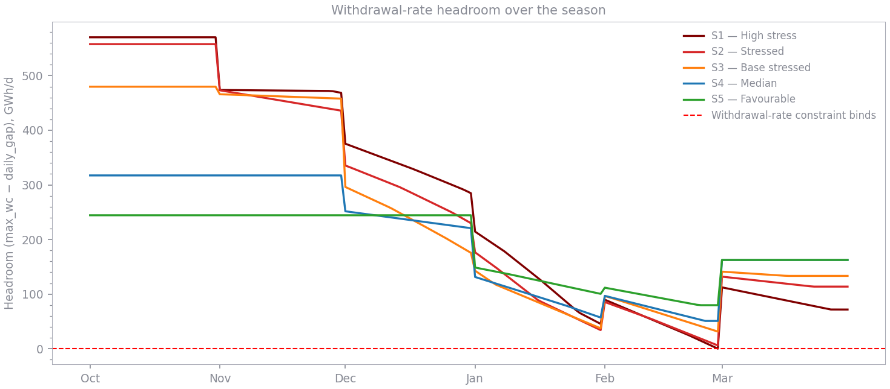
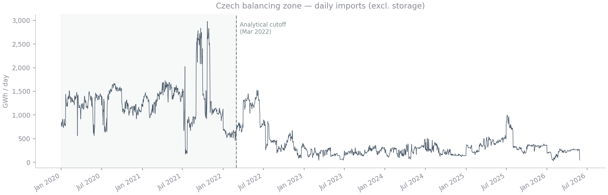

# Czech UGS Storage Target — Results

**Produced by** [`notebooks/storage_target.ipynb`](../notebooks/storage_target.ipynb)  
**Methodology** [`docs/analysis_synthesis_brief.md`](analysis_synthesis_brief.md)  
**Data vintage** ENTSOG Physical Flows through 2026-05-28; GIE storage data through 2026-05-28

---

## What this document answers

> **What working-gas volume must Czech UGS hold on 1 October to survive a
> 1-in-20 cold-winter demand event, at each import-risk scenario?**

The answer depends on how conservatively imports are assumed to behave during
a stressed winter.  Five scenarios are presented, spanning severe import
disruption (S1) to above-average imports (S5).

---

## Method in brief

A daily draw-down simulation runs from 1 October to 31 March (182 days).
At each day:

1. The **daily gap** = max(0, 1-in-20 peak demand − scenario import level),
   both month-specific.
2. The **maximum deliverable withdrawal** is read from the fill-dependent
   withdrawal-capacity curve.  Default: 50/50 blend of empirical P95 and ENTSOG
   engineering curve (10% haircut).  Controlled by the `eng_weight` argument to
   `bsd.fit_withdrawal_curves().blend(eng_weight)`; Branch 2 default is `eng_weight=0.75`.
3. If withdrawal capacity falls below the daily gap, the system is
   **infeasible** (withdrawal-rate binding).
4. Fill level is decremented by the daily gap; if it goes negative the
   system is infeasible (volume binding).

For each scenario, **bisection** finds the minimum starting fill level that
keeps the simulation feasible across all 182 days.  Bisection works here
because feasibility is monotone in starting fill — if a given fill level is
feasible, any higher level is too.  The algorithm maintains a bracket
`[lo, hi]` where `lo` is known infeasible and `hi` is known feasible, tests
the midpoint, and narrows the bracket by half each iteration.  Starting from
`[0%, 100%]`, ~13 iterations reduce uncertainty to under 0.01 percentage
points — far faster than a brute-force scan at the same resolution.

Import levels are treated as deterministic month-specific percentiles —
a conservative upper-bound framing (see Caveats).

---

## Main results

### Minimum required 1-October fill

**Default assumptions: blend WC curve (75% engineering / 25% empirical, 10% haircut) × scenario import percentiles**

| Scenario | Import basis | Start fill (%) | Start fill (TWh) | Binding constraint |
|---|---|---|---|---|
| S1 — High stress    | P10 imports | **55.7** | **25.2** | Withdrawal rate |
| S2 — Stressed       | P20 imports | **48.4** | **21.9** | Volume |
| S3 — Base stressed  | P30 imports | **37.6** | **17.0** | Volume |
| S4 — Median         | P50 imports | **21.9** |  **9.9** | Volume |
| S5 — Favourable     | P70 imports | **11.7** |  **5.3** | Volume |

Czech UGS total working-gas capacity: **45.3 TWh**.  All targets fit within
installed capacity.

### Import capacity ceiling benchmark (P99, cold days)

Under the most favourable defensible import assumption — P99 of imports on cold days
(top-20% storage-withdrawal days per month) — the season target falls to **6.58 TWh
(14.5% fill)**.  This is almost entirely driven by the withdrawal-rate constraint in
January: even with generous imports, storage must start with enough gas to maintain
deliverability through mid-season.

### Key assumption sensitivities (S2 season target)

| WC assumption | Import assumption | 1-Oct target |
|---|---|---|
| Empirical P95 | S2 scenarios | 31.8 TWh |
| **Blend 75/25** | **S2 scenarios** | **21.9 TWh (default)** |
| ENTSOG engineering | S2 scenarios | ~14 TWh |
| Blend 75/25 | P99 cold days | 6.6 TWh |

The 7–32 TWh range represents the full span of defensible choices.
**S2 / blend (21.9 TWh, ~48% fill) is the recommended anchor.**

### Interpretation

**The credible planning anchor is S2 (~22 TWh, 48% fill).**  The blend WC curve
reduces the target substantially from the purely empirical result (32 TWh) by
acknowledging that the observed P95 understates physical deliverability due to
commercial suppression on cold days.

**The binding physical constraint is withdrawal rate for the highest-stress scenario
(S1), and volume for S2–S5.** Under the 75/25 blend the engineering curve keeps
deliverability above the daily gap throughout the simulation for S2–S4 — it is
running out of gas volume that is the limiting factor.  Under the purely empirical
curve (which caps at ~127 GWh/d at 20% fill) S2–S4 would instead be withdrawal-rate
limited, producing the higher 31.8 TWh target.  The choice of WC blend is therefore
the dominant driver of both the constraint type and the headline number.

The mandatory fill target must be set high enough that fill never reaches the zone
where either constraint would bind — the headline TWh is the instrument, and the
rate check is the reason that target must be met, not merely approximated.

This finding means that a storage obligation expressed only in TWh is
**incomplete** without a corresponding minimum rate check.

---

## Fill-level trajectories

The chart below shows the fill-level evolution from 1 October through
31 March, starting from the minimum feasible fill for each scenario.


Key observations:
- S1–S3 all converge toward the ~20% zone by late January / February,
  which is where the withdrawal-rate constraint binds.
- S4 reaches a low of ~17% in February before recovering slightly as March
  demand eases.
- S5, starting at only 11.7%, exhausts storage entirely by late February
  (volume-binding); the 11.7% target is the minimum that just avoids
  running out before the season ends.

---

## Withdrawal-rate headroom

**Headroom** is the margin between what storage *can* deliver and what it
*needs* to deliver on a given day:

```
headroom_t  =  max_wc(fill_pct_t)  −  daily_gap_t
```

where:
- `max_wc(fill_pct_t)` is the withdrawal-capacity curve evaluated at the
  current fill level — how fast gas can physically be extracted that day.
  This value **falls through the season** as fill drops.
- `daily_gap_t` is the shortfall between peak demand and scenario imports
  that storage must cover — fixed within each calendar month but highest in
  January and February.

Both forces push headroom down together: demand is highest precisely when
fill has been drawn down the most.

**How to read the chart:**
- **Large positive headroom** — storage is operating well within its
  physical limits; the system could absorb worse demand or lower imports
  without failing.
- **Headroom near zero** — the system is close to its delivery ceiling.
  Feasible, but with no buffer against further deterioration (a colder
  day, a lower import day, or a slightly lower starting fill).
- **Negative headroom** — infeasible: gas remains in storage but cannot
  be extracted fast enough to meet the daily gap. This is the
  withdrawal-rate binding failure mode.

The minimum starting fill produced by bisection is set precisely so that
headroom never goes negative — the trajectory grazes zero but does not
cross it.



Headroom is tightest in January and February, consistent with peak demand
and the low fill levels reached by mid-season.  S1 and S2 run with near-zero
headroom for several weeks in January — the simulation is feasible but has
no buffer against further deterioration.

**March note.** An important modelling caveat is that March headroom appears
comfortable in this simulation because the 1-in-20 demand profile shows March
easing to ~245 GWh/d and imports recovering.  In practice, a late-season cold
snap coinciding with already-depleted storage could be more dangerous than the
model suggests: fill is at its seasonal low, capping delivery rates, while a
cold March can demand almost as much as January.  The sensitivity analysis
(peak +50 GWh/d uniformly applied) provides a partial test, but a March-specific
stress scenario — elevated March demand only, with fill starting at the end-of-
February level from the base run — would give a sharper view of this risk.

---

## Withdrawal capacity curve (reference)

The default curve is a 50/50 blend of the empirical P95 and the ENTSOG engineering
curve (10% haircut applied before blending).  Branch 2 uses a 75/25 blend (higher
engineering weight) because the season-long simulation regularly reaches low fill
levels (<20%) where the empirical curve is poorly identified.

| Fill level | Empirical P95 (GWh/d) | ENTSOG engineering −10% (GWh/d) | **Blend 75/25 (GWh/d)** |
|---|---|---|---|
| 20% | ~127 | ~326 | ~276 |
| 30% | ~253 | ~457 | ~406 |
| 50% | ~346 | ~642 | ~568 |
| 70% | ~346 | ~647 | ~572 |

Pass `eng_weight` to `bsd.fit_withdrawal_curves().blend(eng_weight)` to switch curves.
The empirical curve is the conservative floor (deflated by commercial suppression);
the engineering curve is the physical ceiling (declared technical capacity).

---

## Import assumptions (reference)

Month-specific import percentiles used per scenario (GWh/d), plus P99 benchmarks:

| Month | S1 (P10) | S2 (P20) | S3 (P30) | S4 (P50) | S5 (P70) | P99 unconditional | **P99 cold days** |
|---|---|---|---|---|---|---|---|
| Oct | 183 | 213 | 237 | 299 | 357 | 590 | **361** |
| Nov | 148 | 160 | 231 | 284 | 342 | 635 | **352** |
| Dec | 137 | 142 | 150 | 260 | 341 | 391 | **388** |
| Jan | 113 | 135 | 164 | 214 | 272 | 366 | **217** |
| Feb | 120 | 149 | 185 | 215 | 244 | 314 | **258** |
| Mar | 154 | 196 | 216 | 254 | 350 | 820 | **743** |

The cold-day P99 is the relevant import ceiling for a stress event — it conditions on days
when the interconnectors were tested under peak demand.  The unconditional P99 is inflated
by mild-weather high-import days and overstates capacity availability during a cold emergency.
Choose which benchmark to use by passing `p99_cold` or `p99_uncond` from
`bsd.compute_p99_imports()` as the import Series in the ceiling scenario.

Historical context — post-2022 winter imports by season:



---

## Sensitivity analysis

Starting-fill requirement (TWh) under alternative demand assumptions (blend WC, scenario imports):

| Scenario | Base (blend WC) | Peak +50 GWh/d | Peak −50 GWh/d |
|---|---|---|---|
| S1 | 25.2 | ~35 | ~18 |
| S2 | 21.9 | ~30 | ~15 |
| S3 | 17.0 | ~25 | ~10 |
| S4 |  9.9 | ~18 |  ~4 |
| S5 |  5.3 | ~17 |  ~2 |

**Peak demand sensitivity** is meaningful: a 50 GWh/d uniform shift in the
1-in-20 demand profile changes the S2 target by roughly ±7–8 TWh.  Demand
forecasts should be treated as a material input, not a background parameter.

**Withdrawal curve and import ceiling sensitivities** are summarised in the
assumption sensitivity table above.  The WC assumption is the dominant driver
(>10 TWh range for S2); the import ceiling adds a further ~15 TWh of range
at the favourable end.

---

## Caveats

**1. Deterministic monthly imports.** Month-specific percentiles are applied
as a constant for every day within that month.  Real within-month variability
allows buffering across days (a bad day is partly offset by a better one),
so this approach is conservative — the true required fill is likely somewhat
lower.  Results are therefore best read as an upper-bound at each scenario.

**2. Withdrawal curve assumption.** Two boundary curves bracket deliverability: the
empirical P95 (floor) and ENTSOG engineering curve (ceiling).  The default 75/25 blend
is motivated by the season-long simulation regularly reaching low fill levels where
empirical data are sparse; the engineering curve is better-identified there.  The
assumption sensitivity table quantifies the impact.  Pass `eng_weight` to
`bsd.fit_withdrawal_curves().blend(eng_weight)` to switch curves.

**3. Injection feasibility not checked.** The model assumes any 1-October
target is achievable via summer injection.  At 32 TWh (S2) this is plausible
but should be verified against injection-rate constraints, EU filling
obligations, and hub-price economics.  Targets above ~35 TWh warrant an
explicit injection-side review.

**4. Demand/import correlation.** Cold snaps simultaneously raise Czech
demand and depress German hub deliverability, so the two risk drivers are
negatively correlated in the tail.  The deterministic scenario framing
(e.g. "S2 ≈ 1-in-100") is optimistic: the true joint exceedance probability
is worse than the product of marginals.  A copula-based joint model is the
recommended next step before using any number here as a binding regulatory
target.
